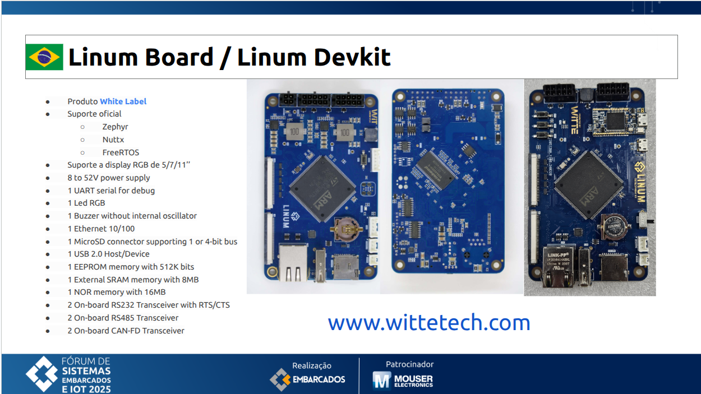

# Fórum de Sistemas Embarcados e IoT 2025

> Palestra: **Zephyr RTOS: Primeiros Passos**  
> Palestrante: **Jorge Guzman**

Contém código de exemplo, guias de instalação e documentação prática para desenvolvedores que desejam começar a trabalhar com Zephyr RTOS.

## Sobre

Material prático para iniciantes que desejam começar a trabalhar com Zephyr RTOS, desde a instalação do ambiente até a execução do primeiro projeto.

## 🛠️ Hardware Utilizado



Este projeto foi desenvolvido e testado com:

* **PC:** Ubuntu 22.04
* **Placa:** [Linum (STM32H753BI)](https://wittetech.com/#linum) da witte technology
* **Zephyr RTOS:** v4.2.0
* **Zephyr SDK:** v0.17.2

## 1. Guia de instalação

Guia de instalação do ambiente de desenvolvimento do Zephyr RTOS: [Getting Started Guide](https://docs.zephyrproject.org/latest/develop/getting_started/index.html)

### 1.1 Placas Suportadas

Lista completa de placas suportadas pelo Zephyr RTOS: [Boards Supported](https://docs.zephyrproject.org/latest/boards/index.html#)

### 1.2 Device Tree (DTS)

Documentação de bindings e configuração de Device Tree para periféricos: [Device Tree (DTS) Documentation](https://docs.zephyrproject.org/latest/build/dts/api/bindings.html)

### 1.3 Template de Projeto

Repositorio git com o exemplo de template para iniciar um novo projeto com Zephyr RTOS: [exemple-application](https://github.com/zephyrproject-rtos/example-application/)

### 1.4 Portando Novas Placas

Guia oficial para portar um hardware customizado usando o Zephyr RTOS: [Board Porting Guide](https://docs.zephyrproject.org/latest/hardware/porting/board_porting.html)

## 2. Build Manual

Antes de compilar, ative o ambiente virtual e configure as variáveis do Zephyr:

```bash
app$ source ~/zephyrproject/.venv/bin/activate
app$ export ZEPHYR_BASE=~/zephyrproject/zephyr
```

Build otimizada para ambiente de produção

```bash
app$ west build -b linum -p -- -DDTC_OVERLAY_FILE=boards/linum.overlay
-- Zephyr version: 4.2.0 (/home/jaga/zephyrproject/zephyr), build: v4.2.0
[160/160] Linking C executable zephyr/zephyr.elf
Memory region         Used Size  Region Size  %age Used
           FLASH:       23804 B         2 MB      1.14%
             RAM:        4864 B       512 KB      0.93%
...
```

Build com símbolos de debug e logs habilitados:

```bash
app$ west build -b linum -p -- -DDTC_OVERLAY_FILE=boards/linum.overlay -DOVERLAY_CONFIG=debug.conf
[198/198] Linking C executable zephyr/zephyr.elf
Memory region         Used Size  Region Size  %age Used
           FLASH:       79900 B         2 MB      3.81%
             RAM:         13 KB       512 KB      2.54%
...
```

Comando para gravacao do binario gerado

```bash
app$ west flash
```

Comando para analise de consumo de memoria flash e ram

```bash
app$ west build -t rom_report
app$ west build -t ram_report
```

## 3. Build e Debug Utilizando o VSCode

Para habilitar o debug no VSCode, é necessário instalar dois pacotes adicionais, que incluem os drivers para ST-Link e J-Link, essenciais para a depuração de dispositivos STM32.

* [STM32CubeIDE](https://www.st.com/en/development-tools/stm32cubeide.html)
* [STM32CubeProgrammer](https://www.st.com/en/development-tools/stm32cubeprog.html)

Os seguintes arquivos devem ser criados no diretório raiz do projeto para configurar o ambiente de build e debug no VSCode:

```bash
app$ tree .vscode
.vscode
├── launch.json
├── settings.json
└── tasks.json
└── extensions.json
```

### 3.1. Arquivo **[extensions.json](app/.vscode/extensions.json)**

Este arquivo recomenda automaticamente as extensões essenciais do Visual Studio Code para configurar o ambiente de desenvolvimento com Zephyr RTOS.

### 3.2 Arquivo **[settings.json](app/.vscode/settings.json)**

Este arquivo configura o ambiente de desenvolvimento do Visual Studio Code para projetos Zephyr RTOS. 

Ele contém as seguintes configurações principais:

#### Ambiente Python e Zephyr

* Define o interpretador Python do ambiente virtual do Zephyr
* Configura as variáveis `ZEPHYR_BASE` e `ZEPHYR_SDK_INSTALL_DIR`

#### Depuração (Cortex-Debug)

* Configura caminhos para a toolchain ARM, OpenOCD e GDB do Zephyr SDK 0.17.2
* Habilita depuração de microcontroladores ARM

#### IntelliSense C/C++

* Inclui automaticamente o arquivo de configuração do Zephyr (`autoconf.h`)
* Define caminhos de busca para headers do projeto e do Zephyr
* Utiliza o banco de dados de compilação (`compile_commands.json`) gerado pelo West
* Configura padrões C11 e C++20

#### Configurações do Editor

* Desabilita modo preview de arquivos
* Aumenta histórico do terminal para 50.000 linhas
* Personaliza aparência de código inativo

### 3.3 Arquivo **[tasks.json](app/.vscode/tasks.json)**

Este arquivo automatiza o processo de build, depuração e gravação de firmware utilizando o West, a ferramenta de gerenciamento de projetos do Zephyr.

### 3.4 Arquivo **[launch.json](app/.vscode/launch.json)**

Este arquivo de configuração define diferentes perfis de depuração para o microcontrolador utilizando as interfaces J-Link e ST-Link.

## 4. Referências e Arquivos de Verificação

### 4.1 Board Support Package (BSP)

* **[BSP Linum](https://github.com/zephyrproject-rtos/zephyr/tree/main/boards/witte/linum)**
  * Board Support Package (BSP) da placa Linum
  * Inclui configuração padrão de hardware (DTS), Kconfig e definições de pinagem
  * Base para as customizações feitas via overlays no projeto

### 4.2 Arquivos Gerados pelo Build

Após compilar o projeto, o Zephyr gera arquivos úteis para verificar a configuração final do sistema. Estes arquivos ajudam a validar quais macros foram habilitadas e como os arquivos DTS + overlays foram combinados:

* **[zephyr.dts](app/build/zephyr/zephyr.dts)**
  * Device Tree final gerado após processar todos os arquivos .dts, .dtsi e .overlay
  * Útil para verificar a configuração completa do hardware

* **[autoconf.h](app/build/zephyr/include/generated/zephyr/autoconf.h)**
  * Configuração final do Kconfig após merge de prj.conf + arquivos .conf extras (debug.conf, board overlays, etc)
  * Contém todas as macros `CONFIG_*` ativas no projeto
  * Útil para verificar quais features e módulos foram habilitados

* **[zephyr.map](app/build/zephyr/zephyr.map)**
  * Mapa de memória do binário compilado
  * Mostra o tamanho e localização de funções, variáveis e símbolos na memória
  * Útil para análise de uso de memória e otimização
